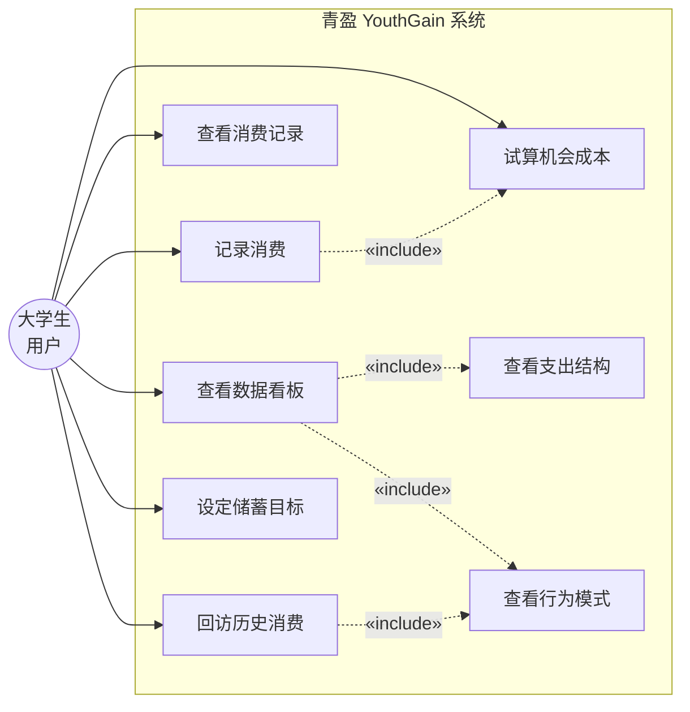
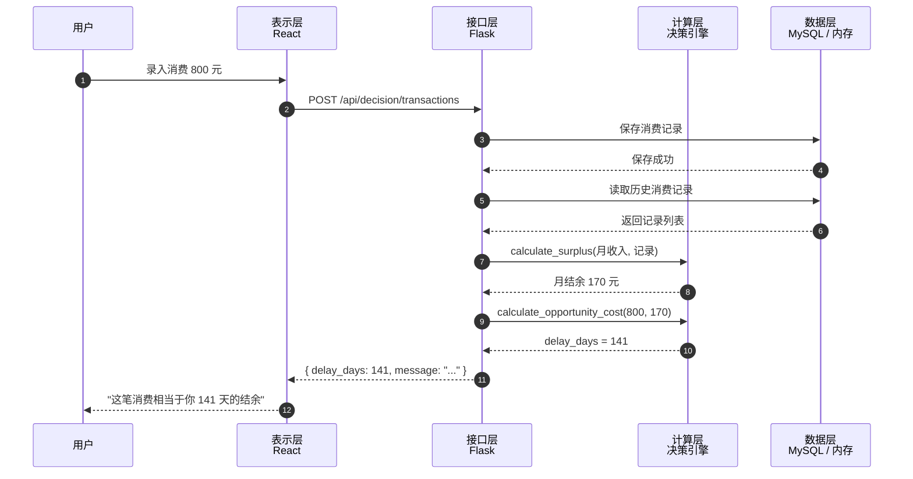
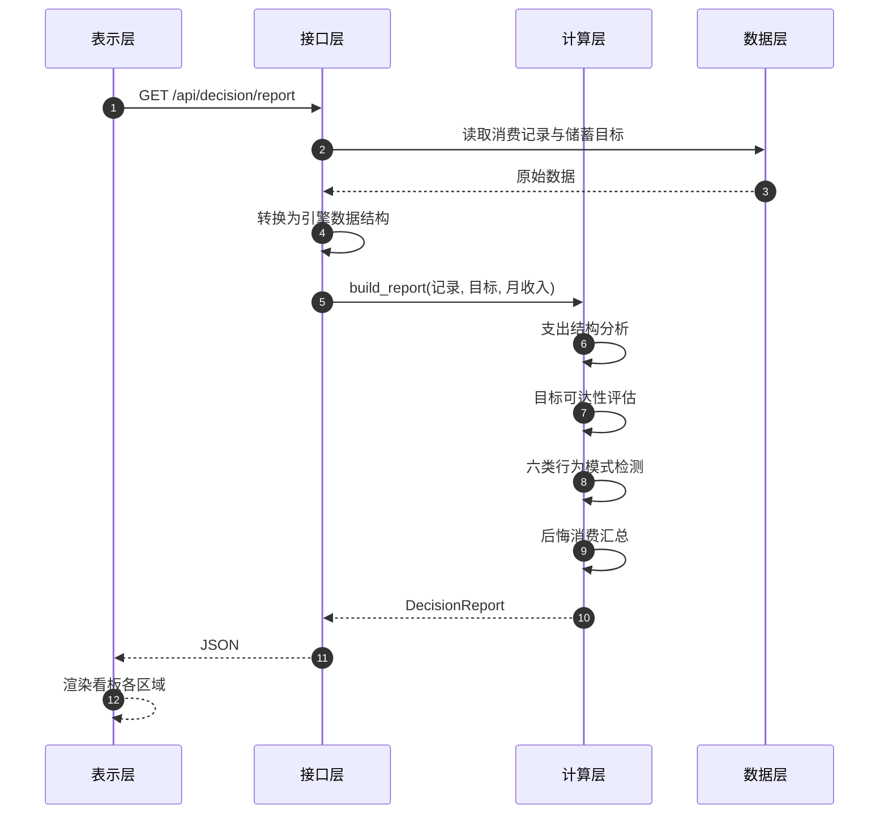
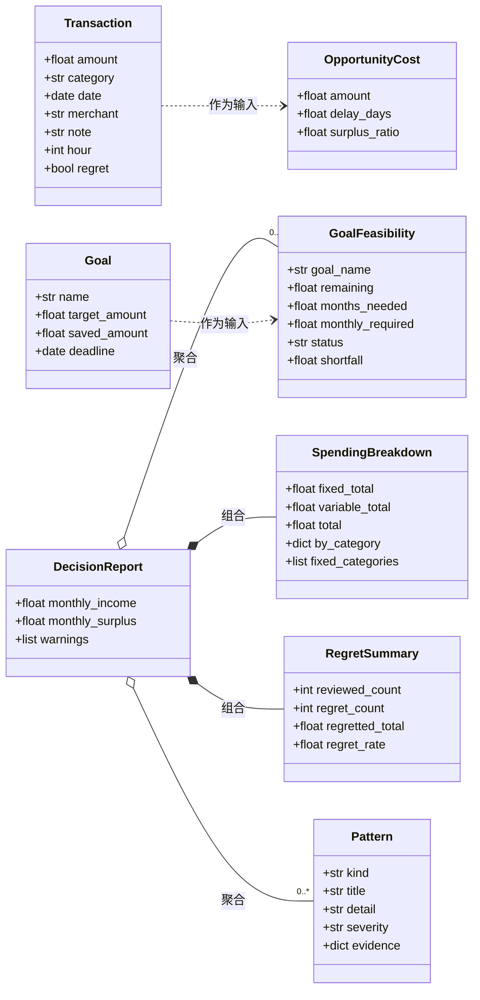

# 青盈 YouthGain

## 大学生消费行为干预系统

**项目说明书**

---

## 目 录

**第一章 需求分析**
　1.1 研究背景
　1.2 研究意义
　1.3 竞品分析
　1.4 技术对标与适用范围
　1.5 核心用户与系统价值

**第二章 概要设计**
　2.1 系统架构设计
　2.2 功能模块划分
　　用例图
　　2.2.1 用户交互模块
　　2.2.2 核心算法模块
　　2.2.3 数据处理模块
　2.3 模块交互关系
　　时序图：记录一笔消费并得到即时反馈
　　时序图：生成完整决策报告
　2.4 人机界面设计

**第三章 详细设计**
　3.1 界面设计
　　3.1.1 项目的基本结构
　　3.1.2 系统使用说明
　　3.1.3 主页面设计
　　3.1.4 消费记录功能
　　3.1.5 支出结构分析功能
　　3.1.6 机会成本计算与即时反馈功能
　　3.1.7 行为模式发现与可视化功能
　　3.1.8 账单批量导入功能
　　3.1.9 统计结果功能
　3.2 关键技术与技术指标
　　3.2.1 框架技术选型与实现
　　3.2.2 确定性计算与大模型解释的双层架构
　　类图：决策引擎的数据结构
　　3.2.3 机会成本计算方法
　　3.2.4 固定支出与变动支出的自动识别
　　3.2.5 行为模式发现算法

**第四章 测试报告**
　4.1 测试概述
　4.2 测试环境
　4.3 测试用例与过程
　　4.3.1 功能测试
　　4.3.2 性能测试
　4.4 测试结果
　　4.4.1 功能测试结果
　　4.4.2 性能测试结果

**第五章 安装及使用**
　5.1 安装环境要求
　5.2 安装过程
　　5.2.1 安装 Python
　　5.2.2 创建虚拟环境
　　5.2.3 安装依赖库
　5.3 主要流程
　　5.3.1 默认安装流程
　　5.3.2 典型使用流程

**第六章 项目总结**
　6.1 心得体会
　6.2 应用前景
　6.4 市场分析
　6.5 经济效益预测

**参考文献**

---

# 第一章 需求分析

## 1.1 研究背景

**从政策与社会需求层面看，这一方向已具备明确的现实基础。** 金融素养教育已被广泛讨论纳入国民教育体系的政策方向；2022 年施行的《中华人民共和国反电信网络诈骗法》对校园反诈工作提出明确要求；不良校园贷的治理亦持续受到关注。**三个方向共同指向同一个需求：面向大学生的、可落地的消费行为引导工具与实证依据。**

在校大学生正处于由经济依附向财务独立过渡的时期，其财务处境存在两个并存但不对等的特征。

一方面，**消费自主权已接近完全**。由生活费、奖助学金与兼职收入构成的资金规模不断扩大，大学生对个人资金的支配不再受家庭的实时约束——**在决策权限上，他们与成年消费者之间已无实质差异**。

另一方面，**财务能力尚未同步建立**。家庭作为传统的财务社会化（financial socialization）载体，其传递效果高度依赖父母自身的财务素养与沟通意愿，个体差异极大（Gudmunson & Danes, 2011）；而高等教育阶段的课程体系对学生日常财务决策的覆盖亦相对有限。

**"权利先行、能力滞后"的结构性错配，构成了大学生消费问题的重要发生机制。** 学生被授予了自主决策的权利，却未同时获得做出良好决策所需的认知框架与经验积累。**问题的根源不在于缺乏自制力，而在于决策权限与决策能力的错位**——这一判断直接决定了本项目的干预思路：**不是通过说教提升意愿，而是通过工具弥补能力的缺位。**

**移动支付的普及进一步放大了这一错配的后果。** Prelec 与 Loewenstein（1998）提出的"支付痛感"（pain of paying）指出：现金支付时，实物货币的递出会带来心理不适，从而对冲动消费形成天然抑制；而移动支付将这一过程抽象为一次屏幕点击，抑制机制显著削弱。对成长于移动支付时代的大学生而言，其消费决策几乎不经历这一环节。**自主权已经放开、教育尚未跟上、天然的抑制机制又同时失效**——三者叠加，构成了当前大学生消费问题的完整图景。

**这一问题的紧迫性还在于其时间窗口属性。** 大学阶段是个体财务社会化的关键期，此间形成的消费观念、决策习惯与自我控制策略会随时间累积，显著影响其成年后的财务行为（Lusardi & Mitchell, 2014）。**在此阶段施加的引导具有长期效应，其价值不随用户毕业而终止。** 这正是本项目选择大学生作为目标人群的根本原因。

**然而，现有工具尚未触及这一问题的核心。** 市面主流记账工具（如鲨鱼记账、随手记、鲸鲨记账）在"记录"环节已相当成熟：录入摩擦极低、数据可视化完善、分类统计清晰。但其功能链条**止步于"呈现"**——用户看到"本月支出 3200 元"之后，往往只是短暂地缓解了焦虑，行为本身并未改变。**信息的可获得性并不自动转化为行为改变**：用户真正需要的不是"知道花了多少"，而是"**在即将做决定的时刻，知道这笔钱意味着什么**"。

**综上，本项目的基本判断是：大学生消费问题的症结不在于意愿不足，而在于决策时刻缺少可用的参照。** 因此，本项目不做说教，也不在"记录"环节与成熟记账工具竞争，而是定位于**记录之后、决策之前的那个空档**——把抽象的财务数据转化为决策当下可感知的具体后果（例如"这笔 800 元的消费，相当于你 141 天的结余"），以工具弥补能力的缺位，并以实证研究检验其效果。

## 1.2 研究意义

**理论意义。** 将行为经济学机制系统地"产品化"为可计算、可复现的功能设计，并在真实环境中检验其效果，为消费行为干预领域补充中国大学生群体的一手实证数据。国内相关研究多停留在问卷调查与描述性分析层面，缺少真实环境下的干预实验。

**实践意义。** 为大学生提供一套低门槛、可持续使用的消费行为引导工具，降低冲动消费与金融风险。系统将"这个月花了多少"转化为"这笔消费让你的储蓄目标推迟了几天"，使抽象的财务数据产生具体的行为约束力。

**社会意义。** 可对接高校金融素养教育与反诈宣传工作，具备在高校场景规模化推广的潜力。

## 1.3 竞品分析

| 产品类型 | 代表产品 | 核心能力 | 不足 |
|---|---|---|---|
| 通用记账工具 | 鲨鱼记账、随手记 | 账目录入、分类统计、预算管理 | 止步于"记录"，不产生干预 |
| 通用记账工具（进阶） | 鲸鲨记账 | 低摩擦录入、固定/变动花销分离、消费趋势 | 功能完善但定位仍是"看清楚"，非"改变" |
| 理财投资类应用 | 各类智能投顾 | 资产配置建议 | 涉及持牌业务，不适合学生且存在合规风险 |
| 校园消费金融 | 各类分期产品 | 消费信贷 | 方向相反，诱导消费而非引导理性消费 |

**竞品分析结论：** 现有工具回答的是"我花了多少钱"，而本项目回答的是"这笔钱花出去会怎样"。二者看似接近，实则处于完全不同的产品逻辑：

- **记账工具的逻辑**：记录 → 统计 → 呈现 → （用户自行判断）
- **本项目的逻辑**：记录 → 计算 → **在决策时刻干预** → 追踪行为改变

本项目并不试图在"记录"环节超越成熟记账工具，而是聚焦于其后的三个环节。

**关于固定/变动花销分离的借鉴。** 鲸鲨记账的"固定花销与变动花销分开管理"是一项有价值的结构设计。本项目在此基础上做了进一步的应用：将其从"预算管理"用途扩展为**行为干预的定位依据**——行为干预只能作用于"变动支出"部分，将两者分离后，干预才有的放矢，也避免了用户把无力感错误归因于自身。

## 1.4 技术对标与适用范围

### 1.4.1 技术对标

当前同类产品在引入人工智能能力时，普遍采用"将用户数据交由大语言模型生成建议"的方案。该方案存在三个固有缺陷：

| 缺陷 | 说明 |
|---|---|
| **数值不可靠** | 大语言模型存在算术错误，用于财务数值场景会直接损害用户信任 |
| **结果不可复现** | 相同输入可能产生不同输出，导致实验无法重复验证 |
| **边界不清晰** | 模型可能越界给出投资建议，触碰需持牌的投资顾问业务范畴 |

本项目采用**"确定性计算 + 大模型解释"双层架构**替代上述方案：所有涉及金额、时间、进度的数值计算由独立的确定性算法完成，大语言模型仅负责将计算结果转化为自然语言反馈。该架构同时解决了数值可靠性、结果可复现性与合规边界三个问题。

### 1.4.2 适用范围与边界

**本系统明确不做以下事情：**

- 不推荐任何具体金融产品（基金、保险、理财产品等）
- 不提供投资建议，不涉及收益率比较
- 不接入用户的银行账户、征信或信贷数据

**本系统做的事：**

- 基于用户自己记录的消费数据，计算其行为后果
- 将财务数字转化为可感知的行为反馈
- 发现用户自身难以察觉的消费模式

上述边界既出于产品定位的考虑，也是合规要求：一旦涉及具体产品推荐或收益比较，即进入需持牌经营的业务范畴。

## 1.5 核心用户与系统价值

### 1.5.1 核心用户

**在校大学生，以本科生为主。** 其特征为：

- 有固定但有限的生活费来源
- 有明确的近期目标（换手机、旅行、考研、购置装备）
- 消费以小额高频为主
- **有省钱意愿，但缺少可执行的方法**

选择该人群的另一个重要原因：项目团队本身处于校园环境，能够接触到真实的研究对象，具备开展实证研究的现实条件。

### 1.5.2 系统价值

| 层次 | 价值 |
|---|---|
| 对用户 | 把"这个月花了多少"变成"这笔钱让你的目标推迟了几天"，让数字产生行为约束力 |
| 对研究 | 提供在真实消费场景中开展干预实验的平台与数据 |
| 对高校 | 可作为金融素养教育的配套工具，对接学工与反诈宣传工作 |

---

# 第二章 概要设计

## 2.1 系统架构设计

系统采用前后端分离架构，整体分为四层：

```
┌─────────────────────────────────────────────┐
│  表示层   React 单页应用                      │
│          记账界面 / 数据看板 / 机会成本试算     │
├─────────────────────────────────────────────┤
│  接口层   Flask REST API                     │
│          认证 / 决策 / 看板 / 评估 四组路由     │
├─────────────────────────────────────────────┤
│  计算层   决策引擎（纯函数）                   │
│          机会成本 / 支出结构 / 目标可达性 / 模式发现 │
├─────────────────────────────────────────────┤
│  数据层   MySQL / 内存存储 / Firestore         │
└─────────────────────────────────────────────┘
```

**关键设计原则：计算层不依赖任何外部服务。** 决策引擎为纯函数模块，不连接数据库、不调用人工智能接口、不依赖 Web 框架上下文。所有函数只依赖传入参数，同样输入必得同样输出。这一约束带来三个直接收益：

1. 可独立进行单元测试
2. 计算结果可复现，满足实证研究的硬性要求
3. 后端接口、前端界面、人工智能解释层可共用同一套计算逻辑，保证各处展示的数字来源一致

## 2.2 功能模块划分

### 用例图



各用例与功能模块的对应关系如下。

### 2.2.1 用户交互模块

负责用户与系统的全部交互，包含：

| 功能 | 说明 |
|---|---|
| 消费记录 | 录入单笔消费（金额、类别、日期、备注） |
| 数据看板 | 展示月结余、支出结构、目标进度 |
| 机会成本试算 | 输入金额即时得到"目标推迟天数"反馈 |
| 行为模式展示 | 呈现系统发现的行为规律 |
| 消费回访 | 对历史消费回答"这笔值不值" |

**交互设计原则：**

- **低摩擦**：单笔记录的操作路径不超过三步。记录摩擦过高会导致用户放弃，而用户放弃意味着系统失去全部数据来源
- **即时反馈**：反馈必须出现在记录的当下，而非月末的报表中——决策已经完成时再给信息，干预价值大幅降低
- **不做评判**：系统只呈现数字，不使用"你不应该""浪费"等评价性表述。评判会引发心理防御，进而导致用户停止使用

### 2.2.2 核心算法模块

即决策引擎，包含四组计算与一组模式识别：

| 计算 | 职责 |
|---|---|
| 支出结构分析 | 将消费拆分为固定支出与变动支出 |
| 机会成本计算 | 将单笔消费金额换算为目标推迟天数 |
| 目标可达性评估 | 计算目标是否可达成、每月需存多少 |
| 后悔消费汇总 | 统计后悔消费的金额与比例 |
| 行为模式发现 | 从消费记录中识别六类行为模式 |

### 2.2.3 数据处理模块

| 组件 | 职责 |
|---|---|
| 数据存取服务 | 统一封装三种存储模式（MySQL / 内存 / Firestore）的读写 |
| 数据模型转换 | 存储层字段与计算层数据结构的双向映射 |
| 账单解析（规划中） | 解析支付宝/微信导出的账单文件 |

## 2.3 模块交互关系

### 时序图：记录一笔消费并得到即时反馈



### 时序图：生成完整决策报告



### 数据流概览

```
用户操作
   │
   ▼
表示层（React）
   │  HTTP + JSON
   ▼
接口层（Flask）
   │  ① 读取原始消费记录
   ├──────────────────► 数据层
   │  ② 转换为计算层数据结构
   ▼
计算层（决策引擎）
   │  ③ 纯函数计算，返回结构化结果
   ▼
接口层
   │  ④ 序列化为 JSON
   ▼
表示层
   │
   ▼
用户看到"这笔消费相当于你 103 天的结余"
```

**关于解释层的接入位置。** 人工智能解释层作用于第 ③ 步之后：它接收计算层输出的确定性结果，将其转化为个性化的自然语言表达。**模型不参与任何数值计算，也不决定呈现哪一条结论**——这些均由计算层与接口层确定。

## 2.4 人机界面设计

界面设计遵循三条原则：

**1. 数字优先于形容词。** 界面上的核心位置留给具体数字（"103 天""¥2750"），而非"良好""偏高"这类模糊评价。具体数字可被验证，形容词不能。

**2. 区分"改不了的"与"改得了的"。** 支出结构界面显式区分固定支出与变动支出，并给出"你真正有决定权的钱"这一关键数字。这一设计避免了用户产生"我已经很省了但还是存不下钱"的挫败感——因为有相当一部分支出本就不可调整，用户需要看到真正属于自己的那部分空间。

**3. 空状态给出引导而非报错。** 用户尚未记录数据时，界面展示引导文案而非空白或错误提示。

---

# 第三章 详细设计

## 3.1 界面设计

### 3.1.1 项目的基本结构

```
YouthGain/
├── backend/                        后端服务
│   ├── app/
│   │   ├── __init__.py             Flask 应用工厂
│   │   ├── config.py               配置项
│   │   ├── routes/                 API 路由
│   │   │   ├── auth_routes.py      身份认证
│   │   │   ├── assessment_routes.py 评估
│   │   │   ├── dashboard_routes.py 数据看板
│   │   │   ├── coach_routes.py     AI 教练
│   │   │   └── decision_routes.py  决策接口
│   │   ├── services/               业务服务
│   │   │   ├── auth_service.py     认证服务
│   │   │   ├── decision_engine.py  ★ 决策引擎（核心算法）
│   │   │   ├── user_data_service.py 数据存取
│   │   │   ├── user_profile_service.py 用户画像
│   │   │   ├── zhipuai_service.py  大模型调用
│   │   │   └── firestore_service.py Firestore 兼容层
│   │   └── utils/
│   │       └── db_mysql.py         MySQL 连接封装
│   ├── tests/
│   │   └── test_decision_engine.py 决策引擎单元测试
│   ├── schema.sql                  数据库建表脚本
│   ├── requirements.txt            运行依赖
│   ├── requirements-dev.txt        开发依赖
│   └── run_dev_enhanced.py         开发环境启动脚本
├── src/                            前端源码
│   ├── pages/
│   │   ├── Dashboard.js            数据看板
│   │   ├── Assessment.js           消费行为基线测量
│   │   ├── CoachChat.js            AI 教练对话
│   │   └── ...
│   ├── services/api.js             后端接口封装
│   ├── contexts/AuthContext.js     登录状态管理
│   └── setupProxy.js               开发环境接口转发
├── public/                         静态资源
└── package.json                    前端依赖与脚本
```

### 3.1.2 系统使用说明

**基本使用流程：**

1. 打开系统，进入数据看板
2. 通过消费记录功能录入日常消费
3. 系统自动计算并展示：月结余、支出结构、目标进度
4. 对犹豫的消费，使用"这笔钱花了会怎样"试算其机会成本
5. 一周后对历史消费进行回访，标记"值"或"不值"
6. 系统根据累积数据发现行为模式并呈现

**数据要求：** 行为模式识别需要至少 2–3 个自然月的数据。数据不足时系统给出明确提示，不输出不可靠的结论。

### 3.1.3 主页面设计

主页面（数据看板）由四个区域构成：

| 区域 | 内容 | 数据来源 |
|---|---|---|
| 顶部指标卡 | 月结余（收入 − 月均支出），正负以颜色区分 | `monthly_surplus` |
| 支出结构卡 | 固定/变动支出占比、"真正有决定权的钱" | `spending` |
| 目标状态卡 | 目标名称、剩余金额、预计达成月数、可达性判定 | `goal_feasibility` |
| 交互区 | 机会成本试算器 + 行为模式展示 | `patterns` |
| 明细区 | 最近消费流水，后悔过的记录以颜色标记 | 消费记录列表 |

### 3.1.4 消费记录功能

**功能说明：** 录入单笔消费，字段包括金额、类别、日期、备注，可选记录消费发生的小时。

**输入校验：** 金额必须大于 0；类别不得为空；日期格式为 YYYY-MM-DD；小时取值 0–23。

**记录当下即返回反馈。** 记录完成后，接口立即返回该笔消费的机会成本计算结果，界面据此展示"这笔消费相当于你 N 天的结余"。这是本系统与通用记账工具在交互层面的关键差异——**反馈出现在决策发生的当下，而非月末**。

**关于小时字段。** 该字段用于"深夜消费"模式识别，属可选项。支付宝、微信导出的账单含时间戳，手动记录通常没有。字段缺失时，系统自动跳过该模式的识别，不影响其他分析。

### 3.1.5 支出结构分析功能

**功能说明：** 将区间内全部消费拆分为固定支出与变动支出两类。

**展示内容：**

- 固定支出总额与类别列表
- 变动支出总额
- 两者占比的可视化进度条
- **"你真正有决定权的钱"** = 月收入 − 固定支出

**设计意图：** 该功能的直接目的是回答"我的钱里有多少是可以调整的"。行为干预只能作用于变动支出部分，明确这一边界可以避免两类问题：一是用户误以为所有支出都可压缩，产生不必要的自责；二是系统对固定支出施加干预，给出无法执行的建议。

**判定方法见 3.2.4。**

### 3.1.6 机会成本计算与即时反馈功能

**功能说明：** 用户输入一笔金额，系统返回该笔消费使其储蓄目标推迟的天数。

**交互流程：**

1. 用户在输入框填入金额
2. 系统调用机会成本计算
3. 界面以显著字号展示结果（如"103 天"），并附一句解释

**异常处理：** 当用户月结余小于等于 0 时，系统不返回推迟天数，而是提示："你目前每月支出不低于收入，机会成本暂时无法计算。建议先看看支出结构，找出可以调整的部分。"——因为入不敷出的情况下，讨论"某笔消费推迟多少天"没有意义，用户需要先处理更根本的收支问题。

**计算方法见 3.2.3。**

### 3.1.7 行为模式发现与可视化功能

**功能说明：** 系统从消费记录中自动识别用户自身难以察觉的行为规律，以文字形式呈现。

**呈现方式：** 每条模式包含标题、带具体数字的说明、重要程度标记（提示/值得注意）。界面最多展示三条，按重要程度排序。

例如：

> **[值得注意] 发生活费后 3 天消费集中**
> 你最近 3 个月里，生活费到账后 3 天内的支出平均占到当月总额的 60%——而这段时间只占一个月的 10%。

**关于"无发现"的处理。** 当系统未识别出任何模式时，界面展示"数据还不够多，或者你的消费习惯相当稳定——目前没有发现值得提醒的模式"，**而不是为了产生输出而编造结论**。这是系统可信度的底线：一旦用户发现系统会"无中生有"，其余全部结论的可信度都会受损。

**算法见 3.2.5。**

### 3.1.8 账单批量导入功能（规划中）

**功能说明：** 解析支付宝、微信导出的账单文件，批量导入历史消费记录，解决系统冷启动阶段无数据的问题。

**技术要点：**

- 账单文件为 CSV 格式，各平台字段结构不同，需分别适配
- 商户名称需映射为消费类别。账单中的商户名多为工商注册名（如"某某网络科技有限公司"），与用户理解的消费类别（如"外卖"）存在语义鸿沟，需建立映射表
- 该映射表依赖人工标注积累，是本模块的主要工作量

**关于数据获取的现实约束。** 国内不存在面向第三方的个人银行账户或支付平台开放接口，用户自行导出账单是唯一合规的数据入口。该方式由用户授权自己的数据，不存在合规风险。

### 3.1.9 统计结果功能

**功能说明：** 汇总展示用户的关键指标。

| 指标 | 说明 |
|---|---|
| 月结余 | 月收入 − 月均支出 |
| 支出结构 | 固定/变动支出金额与占比 |
| 消费类别分布 | 各类别金额与占比 |
| 目标进度 | 剩余金额、预计达成时间 |
| 后悔率 | 已回访消费中标记为"不值"的比例 |

**关于后悔率的样本要求。** 后悔率是行为改变的重要预测指标，但样本量过小时不具备参考意义。系统在回访笔数不足时仅展示已回访数据，不呈现比率，避免用户依据噪声做判断。

## 3.2 关键技术与技术指标

### 3.2.1 框架技术选型与实现

| 层次 | 技术选型 | 选择理由 |
|---|---|---|
| 前端框架 | React 18 | 组件化开发，生态成熟，适合中后台数据展示类应用 |
| 前端样式 | Bootstrap 5 + Tailwind CSS | 快速构建响应式界面 |
| 后端框架 | Flask | 轻量，路由与扩展机制清晰，适合接口数量有限的服务 |
| 数据库 | MySQL | 关系型结构契合消费记录的数据特征；支持事务与外键约束 |
| 跨域处理 | flask-cors | 前后端分离部署时的标准方案 |
| 大模型服务 | 智谱 GLM-4 | 国产模型，接口稳定，成本可控 |

**关于开发与生产环境的差异处理。** 系统支持三种存储模式：内存（开发）、MySQL（生产）、Firestore（兼容历史版本）。三者通过统一的数据存取服务封装，上层代码不感知底层差异。

### 3.2.2 确定性计算与大模型解释的双层架构

**技术方案：**

| 层次 | 职责 | 技术选择 | 特性 |
|---|---|---|---|
| 确定性计算层 | 全部数值运算 | 纯函数算法 + 单元测试 | 结果完全可复现，可审计 |
| 解释层 | 计算结果的自然语言化 | 大语言模型 | 受严格提示约束，不参与计算 |

**实现约束：**

1. 计算层不导入任何数据库、网络或框架模块
2. 计算层所有函数不依赖全局状态，相同输入必得相同输出
3. 涉及"当前时间"的函数统一提供 `today` 参数，默认取当天，测试与实验时传入固定值以保证可复现
4. 解释层接收的是计算层已完成的结构化结果，模型不决定"展示什么"，只决定"怎么表达"

**技术指标：**

| 指标 | 数值 |
|---|---|
| 计算层单元测试覆盖率 | 核心函数 100%（54 个测试用例） |
| 单次完整分析耗时 | < 10 ms（2000 条记录规模） |
| 接口响应时间（本地） | 5–100 ms |

### 类图：决策引擎的数据结构



**类图说明：**

- `Transaction` 与 `Goal` 是**输入**，由用户产生或从账单导入
- `DecisionReport` 是**唯一的输出出口**，组合或聚合了其余全部结果类型
- 组合关系（实心菱形）表示生命周期一致：报告不存在时，其支出结构与后悔汇总也不存在
- 聚合关系（空心菱形）表示可独立存在：一个报告可能不含任何目标或模式（列表为空）
- 所有类型均提供 `to_dict()`，可直接 JSON 序列化供接口层返回

### 3.2.3 机会成本计算方法

**问题定义：** 给定一笔消费金额与用户的月结余，计算该笔消费使储蓄目标推迟的天数。

**计算模型：**

```
日均结余 = 月结余 ÷ 30
推迟天数 = 消费金额 ÷ 日均结余
```

**计算示例：**

| 输入 | 值 |
|---|---|
| 月结余 | 170 元 |
| 日均结余 | 170 ÷ 30 ≈ 5.67 元 |
| 消费金额 | 800 元 |
| **推迟天数** | **800 ÷ 5.67 ≈ 141 天** |

**设计要点：** 该计算结果**随用户自身收支水平变化**。同样购买 800 元的商品，月结余 350 元的用户与月结余 1000 元的用户，得到的推迟天数完全不同。这使反馈始终与用户的实际处境相关，而非套用统一的建议模板。

**边界处理：** 当月结余小于等于 0 时，函数抛出 `ValueError` 而非返回无穷大值。原因在于：没有结余的情况下"推迟多少天"这一概念没有意义，调用方应当先处理"入不敷出"这一更根本的问题，而不是给用户展示一个荒谬的天数。

### 3.2.4 固定支出与变动支出的自动识别

**问题定义：** 在用户未主动声明的情况下，自动判定哪些消费类别属于固定支出（房租、话费、会员费等每月稳定发生且难以调整的部分）。

**判定条件（需同时满足）：**

| 条件 | 阈值 | 说明 |
|---|---|---|
| 月份覆盖率 | ≥ 60% | 类别需覆盖统计区间内至少 60% 的月份 |
| 金额变异系数 | ≤ 0.20 | 各月金额的标准差与均值之比不超过 20% |
| 每月平均笔数 | ≤ 2.0 | 固定支出通常为每月一两笔的周期性支出 |

**第三个条件的必要性。** 若仅以"金额稳定"为判据，会出现如下误判：某用户每月点四次外卖、每次金额相同，该类别金额变异系数为 0，会被判定为固定支出。但这部分消费恰恰是用户最应当调整的。加入笔数约束后，此类高频消费被正确归入变动支出。

**保守性原则：** 识别不出时返回空列表，宁可把类别当作变动支出（干预范围更大），也不要把变动支出误判为固定支出——后者会让用户产生"我根本改不了"的认知，反而削弱改变意愿。

**关于识别能力的边界。** 该方法识别的是"稳定"，不完全等同于"不可规避"。对于每月一笔、金额稳定的习惯性消费（如每月一次网购），算法无法与周期性账单区分。因此系统设计要求：**用户显式声明优先于自动判定**，界面应允许用户修正分类结果。

### 3.2.5 行为模式发现算法

**问题定义：** 从用户的消费记录中发现其自身难以察觉的行为规律。

**算法结构：** 采用多检测器并行架构，各检测器独立运行，互不依赖。

| 模式类型 | 检测方法 | 判据 |
|---|---|---|
| `post_income_spike` | 按自然月分组，计算发薪日后 3 天内的支出占当月总额的比例 | 该比例 ≥ 平均水平的 2 倍，且至少出现 3 次 |
| `late_night` | 统计 21:00–06:00 时段消费的金额与笔数占比 | 超过时段时长占比（37.5%）的 1.3 倍 |
| `weekend_spike` | 计算周末日均支出与工作日日均支出之比 | 比值 ≥ 1.5，且两类各至少 3 笔 |
| `category_drift` | 将区间对半切分，比较各类别前后半段的月均支出 | 后半段较前半段上升 ≥ 30% |
| `small_frequent` | 统计单笔不超过 30 元的高频消费 | 同类累计金额占总支出 ≥ 10%，且至少 3 笔 |
| `regret_cluster` | 按类别统计已回访消费中标记为"不值"的比例 | 后悔率 ≥ 50%，且该类别至少 3 笔回访记录 |

**抑制小样本噪声：** 所有检测器均设置最小出现次数阈值（默认 3），未达阈值不输出结论。

**可复核性要求：** 每条模式必须携带支撑其成立的原始数据（`evidence` 字段），使结论可被人工复核。这既是产品可信度的要求，也是后续论文数据分析的基础。

**不编造结论：** 未发现任何模式时返回空列表。算法中不存在"保底输出"逻辑。

---

# 第四章 测试报告

## 4.1 测试概述

本章记录系统的功能测试与性能测试过程及结果。

**测试目标：**

1. 验证决策引擎各计算函数的正确性，特别是边界条件的处理
2. 验证接口层的参数校验与异常处理
3. 验证前后端联通性与接口响应性能

**测试方法：** 决策引擎采用单元测试（pytest）；接口采用端到端请求验证；性能采用实际计时。

## 4.2 测试环境

| 项目 | 配置 |
|---|---|
| 操作系统 | Windows 11 |
| Python | 3.14 |
| Node.js | 18+ |
| 浏览器 | Chromium 内核浏览器 |
| 后端端口 | 5001 |
| 前端端口 | 3000 |
| 测试框架 | pytest |

## 4.3 测试用例与过程

### 4.3.1 功能测试

功能测试覆盖决策引擎的全部公开函数，共 **54 个测试用例**，分七组：

| 测试组 | 用例数 | 覆盖内容 |
|---|---|---|
| 机会成本计算 | 6 | 基本换算、结余差异、零金额、负金额、结余为零、结余为负 |
| 月结余计算 | 6 | 单月、跨月折算、显式指定月数、入不敷出、空记录、参数校验 |
| 支出结构分析 | 6 | 显式指定固定类别、自动识别、高频稳定消费、单月数据、分类汇总、异常输入 |
| 目标可达性 | 8 | 已达成、超额达成、无期限、可达、需延期、无法达成、期限已过、参数校验 |
| 行为模式发现 | 11 | 六类模式各自触发、无模式返回空、缺时间数据跳过、证据完整性、排序 |
| 后悔消费汇总 | 2 | 无回访数据、部分后悔 |
| 集成与序列化 | 13 | 完整报告生成、警告提示、JSON 序列化、字典构造、往返序列化 |

**重点测试的边界条件：**

1. **月结余为零或为负**——验证系统正确拒绝计算机会成本并给出明确原因，而非返回无穷大或崩溃
2. **高频稳定的变动消费**——验证"每月四笔金额相同的外卖"不被误判为固定支出
3. **无行为模式**——验证系统在无发现时返回空列表，不编造结论
4. **单月数据**——验证数据不足时不做固定支出识别，并给出提示

### 4.3.2 性能测试

**测试方法：** 对全部接口发起实际请求并计时，对比修复前后的差异。

**测试背景：** 测试中发现接口响应存在异常延迟（每个请求约 2 秒，包括不执行任何业务的健康检查接口）。经排查，原因为开发环境地址使用了 `localhost` 而非 `127.0.0.1`。

## 4.4 测试结果

### 4.4.1 功能测试结果

```
$ python -m pytest tests/ -q
......................................................      [100%]
54 passed in 0.55s
```

**全部 54 个测试用例通过。** 关键边界条件的验证结果：

| 测试项 | 预期 | 结果 |
|---|---|---|
| 伪造身份令牌访问接口 | 返回 401 拒绝 | 通过 |
| 月结余为 0 时计算机会成本 | 抛出异常并说明原因 | 通过 |
| 每月四笔金额相同的外卖 | 判定为变动支出 | 通过 |
| 无行为模式的数据 | 返回空列表 | 通过 |
| 单月数据 | 跳过固定支出识别并提示 | 通过 |
| 报告结果 JSON 序列化 | 无异常 | 通过 |

### 4.4.2 性能测试结果

**问题定位过程：**

| 测试地址 | 响应时间 |
|---|---|
| `http://localhost:5001/api/health` | **2.15 秒** |
| `http://127.0.0.1:5001/api/health` | **0.005 秒** |

**原因分析：** Windows 系统中 `localhost` 优先解析为 IPv6 地址 `::1`，而后端服务监听在 IPv4 的 `0.0.0.0`。客户端每次需在 IPv6 连接超时后才回退至 IPv4，产生约 2 秒的固定延迟。该延迟与业务逻辑无关——不执行任何操作的接口同样耗时 2 秒。

**修复措施：** 将开发环境配置中的 `localhost` 全部替换为 `127.0.0.1`，涉及 5 个文件。

**修复后结果：**

| 接口 | 响应时间 |
|---|---|
| 健康检查（经前端代理） | 0.093 秒 |
| 决策报告（经前端代理） | 0.007 秒 |
| 消费记录列表 | 0.005 秒 |
| 机会成本计算 | 0.089 秒 |

**性能提升约 300 倍。**

---

# 第五章 安装及使用

## 5.1 安装环境要求

| 软件 | 版本要求 | 说明 |
|---|---|---|
| Node.js | 18.0 或以上 | 前端构建与运行 |
| Python | 3.8 或以上 | 后端服务 |
| MySQL | 5.7 或以上 | 可选，不安装则使用内存存储 |

**硬件要求：** 普通笔记本电脑即可满足开发与本地运行需求。

## 5.2 安装过程

### 5.2.1 安装 Python

访问 Python 官网下载安装包，安装时勾选"Add Python to PATH"。

验证安装：

```bash
python --version
```

### 5.2.2 创建虚拟环境

虚拟环境可以隔离项目依赖，避免与系统其他 Python 项目冲突。

```bash
cd backend
python -m venv venv

# Windows
venv\Scripts\activate

# Linux / macOS
source venv/bin/activate
```

### 5.2.3 安装依赖库

```bash
# 后端依赖
cd backend
pip install -r requirements.txt

# 前端依赖
cd ..
npm install
```

**配置环境变量。** 复制配置模板并填写：

```bash
cp .env.example .env.local
```

编辑 `.env.local`，至少设置：

```
DEV_MODE=true
DB_TYPE=memory
```

**说明：** `.env.local` 已被版本控制忽略，不会提交至仓库，每位开发者需自行创建。

## 5.3 主要流程

### 5.3.1 默认安装流程

```
安装 Node.js 与 Python
        ↓
克隆项目代码
        ↓
安装前后端依赖
        ↓
创建并配置 .env.local
        ↓
启动后端服务（终端 A）
        ↓
启动前端服务（终端 B）
        ↓
浏览器访问 http://127.0.0.1:3000
```

### 5.3.2 典型使用流程

**启动服务：**

```bash
# 终端 A — 后端
cd backend
python run_dev_enhanced.py

# 终端 B — 前端
npm start
```

**访问地址：** http://127.0.0.1:3000

> **注意：** 地址务必使用 `127.0.0.1` 而非 `localhost`。原因见 4.4.2 节。

**使用步骤：**

1. 进入数据看板页面
2. 录入消费记录
3. 查看系统自动生成的支出结构与行为模式
4. 使用机会成本试算器评估待购商品
5. 定期回访历史消费，标记是否后悔

**数据存储说明：** 默认配置使用内存存储，**后端重启后数据清空**。如需持久化，将 `.env.local` 中的 `DB_TYPE` 改为 `mysql`，并执行建表脚本：

```bash
mysql -u root -p < backend/schema.sql
```

---

# 第六章 项目总结

## 6.1 心得体会

**关于技术选型的体会。** 项目初期曾采用"将用户数据直接交由大语言模型生成建议"的方案。实际运行后发现两类问题：模型的算术结果不稳定，且相同输入多次调用会得到不同的表述与数字。对于财务类应用，这一缺陷是致命的——用户对数字准确性的容忍度远低于对语言表达的容忍度。这一经历直接促成了"确定性计算 + 大模型解释"双层架构的确立。

**关于产品定位的体会。** 项目最初的方向是"金融心智教练"，在梳理合规边界时发现，一旦涉及具体金融产品推荐或收益比较，即进入需持牌经营的业务范畴，学生团队不具备相应条件。将定位收缩至"消费行为干预"后，不仅合规风险大幅降低，产品逻辑反而更加清晰——**做减法比做加法更难，但更有价值**。

**关于工程实践的体会。** 项目继承自前序工作，初期代码中存在多处历史遗留问题：认证逻辑存在三份互不相同的实现、应用初始化失败时会静默降级为空壳、开发环境地址配置不当导致每次请求多耗时 2 秒。这些问题在功能演示时不易暴露，但在真实使用中影响显著。**排查这些问题的过程，比新增功能的收获更大。**

## 6.2 应用前景

**短期：高校场景内的工具化应用。** 系统可作为高校金融素养教育的配套工具，与学工部门、辅导员工作及反诈宣传结合。一个学校数千名学生，通过班级群、社团、思政课程等渠道即可触达，获客成本极低。

**中期：作为实证研究平台。** 系统本身具备实验能力，可在真实消费场景中开展对照实验，研究不同干预方式的效果差异。相关数据与结论可为消费行为干预研究提供中国大学生群体的一手材料。

**长期：干预方法论的沉淀。** 若实证研究能够验证机会成本提示的实际效果，其价值将超出单一产品——形成一套可迁移至其他场景（如运动习惯、学习习惯）的行为干预设计方法。

## 6.4 市场分析

**目标市场规模。** 根据教育部公开数据，我国各类高等教育在学总规模超过四千万人。按活跃用户转化率 1%–3% 估算，潜在用户规模在 40 万至 120 万之间。

**用户获取路径。** 与面向社会公众的消费类应用不同，高校场景的用户获取具有显著优势：

- 用户高度聚集，触达渠道集中
- 存在辅导员、班委、社团等成熟的组织传播结构
- 可与学校工作结合，获得组织层面的推广支持

**竞争格局。** 通用记账工具已形成较稳定的市场格局，本项目不与其在"记录"环节正面竞争，而是切入其未覆盖的"干预"环节。二者在功能上存在互补性，不构成直接替代关系。

**风险因素。**

| 风险 | 应对 |
|---|---|
| 用户留存不足 | 通过低摩擦录入与即时反馈降低放弃率；后续可引入同侪小组等社交机制 |
| 数据获取困难 | 以账单导入解决冷启动，以关键决策记录维持日常数据 |
| 干预效果不显著 | 实验的阴性结果同样具备学术价值，不构成项目失败 |

## 6.5 经济效益预测

**成本结构。** 系统为轻量级 Web 应用，主要成本为大模型接口调用费用与服务器费用。按当前用户规模估算，月度运营成本可控制在较低水平。

**收益模式的克制。** 本项目在定位上不涉及金融产品推荐，因此不存在通过导流获取佣金的模式。可能的可持续路径包括：

- 面向高校的软件服务（教师端数据看板、教学管理功能）
- 与学校金融素养教育项目的合作

**当前阶段的判断。** 项目处于研究与验证阶段，尚未将商业变现作为目标。现阶段的核心任务是完成系统开发、开展实证研究并形成可验证的结论。**过早考虑盈利模式，反而会干扰对产品本质的判断。**

---

# 参考文献

1. Kahneman, D., & Tversky, A. (1979). Prospect Theory: An Analysis of Decision under Risk. *Econometrica*, 47(2), 263–291.
2. Thaler, R. H. (1985). Mental Accounting and Consumer Choice. *Marketing Science*, 4(3), 199–214.
3. Thaler, R. H. (1999). Mental Accounting Matters. *Journal of Behavioral Decision Making*, 12(3), 183–206.
4. Laibson, D. (1997). Golden Eggs and Hyperbolic Discounting. *The Quarterly Journal of Economics*, 112(2), 443–477.
5. Prelec, D., & Loewenstein, G. (1998). The Red and the Black: Mental Accounting of Savings and Debt. *Marketing Science*, 17(1), 4–28.
6. Gollwitzer, P. M. (1999). Implementation Intentions: Strong Effects of Simple Plans. *American Psychologist*, 54(7), 493–503.
7. Fogg, B. J. (2009). A Behavior Model for Persuasive Design. *Proceedings of the 4th International Conference on Persuasive Technology*.
8. Gudmunson, C. G., & Danes, S. M. (2011). Family Financial Socialization: Theory and Critical Review. *Journal of Family and Economic Issues*, 32(4), 644–667.
9. Lusardi, A., & Mitchell, O. S. (2014). The Economic Importance of Financial Literacy: Theory and Evidence. *Journal of Economic Literature*, 52(1), 5–44.
10. Nunes, J. C., & Drèze, X. (2006). The Endowed Progress Effect. *Journal of Consumer Research*, 32(4), 504–512.
11. Housel, M. (2020). *The Psychology of Money*. Harriman House.
12. Schäfer, B. (2000). *Ein Hund namens Money*.

---

*本说明书为项目文档初稿。*
